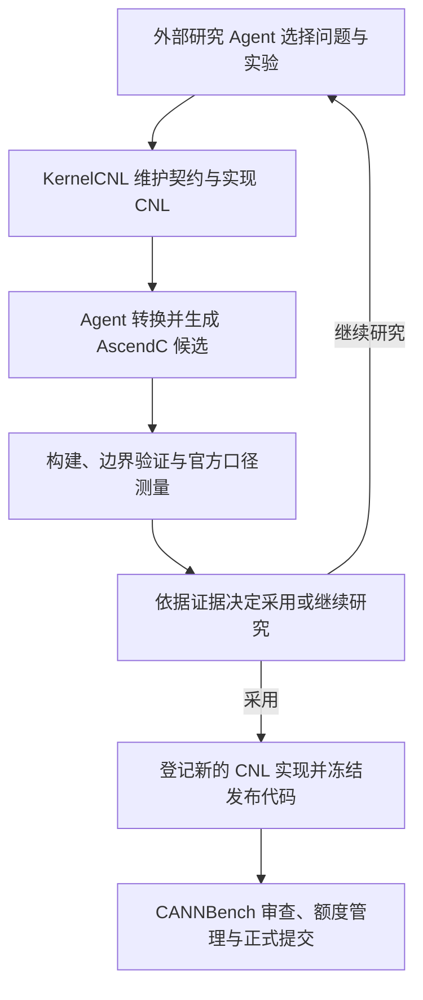

```mermaid
flowchart TD
    A[外部研究 Agent 选择问题与实验] --> B[KernelCNL 维护契约与实现 CNL]
    B --> C[Agent 转换并生成 AscendC 候选]
    C --> D[构建、边界验证与官方口径测量]
    D --> E[依据证据决定采用或继续研究]
    E -->|采用| F[登记新的 CNL 实现并冻结发布代码]
    E -->|继续研究| A
    F --> G[CANNBench 审查、额度管理与正式提交]
```
