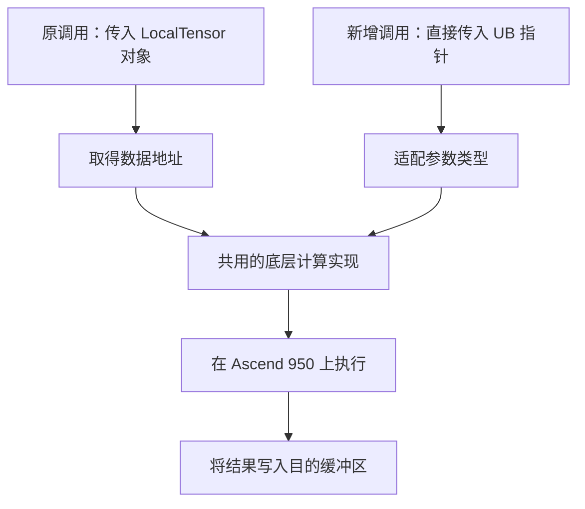

```mermaid
flowchart TD
    A["原调用：传入 LocalTensor 对象"] --> C["取得数据地址"]
    B["新增调用：直接传入 UB 指针"] --> D["适配参数类型"]
    C --> E["共用的底层计算实现"]
    D --> E
    E --> F["在 Ascend 950 上执行"]
    F --> G["将结果写入目的缓冲区"]
```